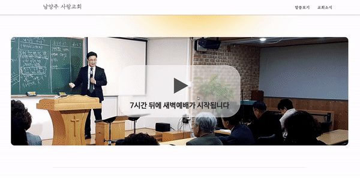
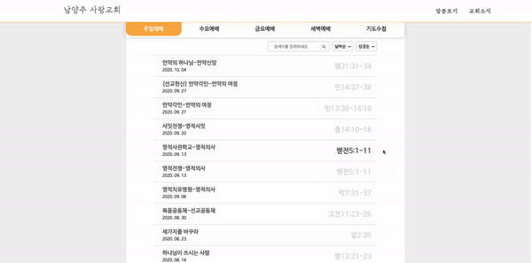
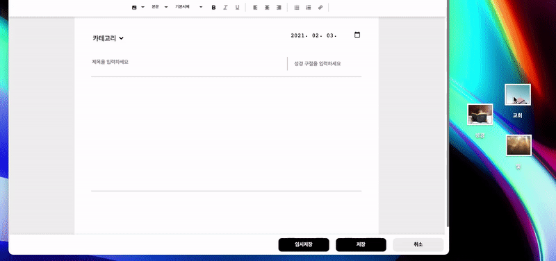
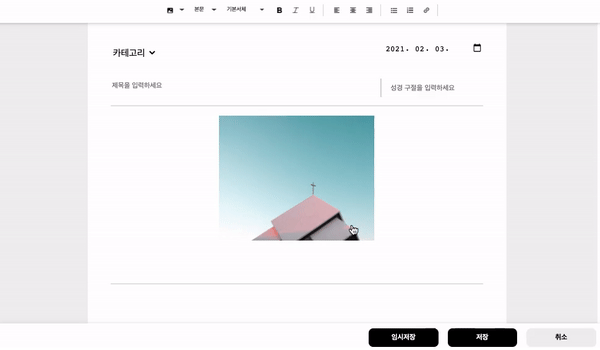
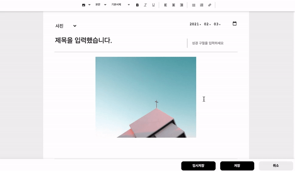
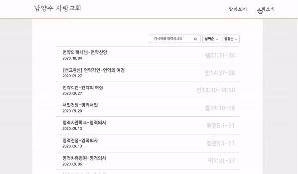
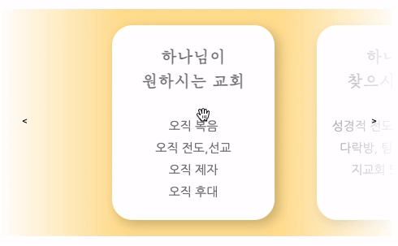
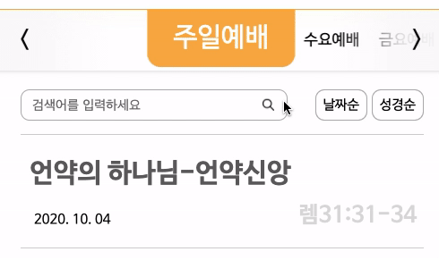
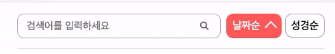
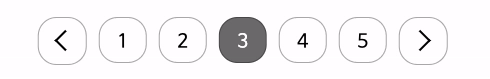

           

  <a href="http://nsarang.or.kr">
    남양주 사랑교회 홈페이지
  </a>

 
 

# **Details**

## **서비스 페이지**

### 1. 모바일 환경 최적화

  
더보기

  
  

    교인들이 주로 모바일로 홈페이지에 접속하기 때문에  
    모바일에서 사용하기 편한 UI를 구성하였습니다.
      
    
  

 

### 2. 라이브 영상 예배

  
더보기

  

    생방송으로 예배를 드릴 수 있으며,  
    다음 예배까지 몇 시간이 남았는지 표시해줍니다. 
      
    
  

 

### 3. 성경 구절 보기

  
더보기

  

    일일이 성경책을 찾는 대신에 클릭하여 말씀의 성경 구절을 볼 수 있습니다.
      
    
  

 
 

## **어드민 페이지**

### 1. 드래그 앤 드롭 

  
더보기

  

    이미지를 편하게 업로드할 수 있습니다.
      
    
  

 

### 2. 영상/이미지 크기 변경

  
더보기

  

    이미지를 클릭하면 나오는 핸들로 크기를 마음대로 조절할 수 있습니다.
      
    
  

 

### 3. 자동 임시 저장

  
더보기

  

    작업 내용이 일정시간마다 임시로 저장되어 내용이 사라질 경우를 대비했습니다.
      
    
  

 
 

## **인터페이스**

### 1. 스켈레톤 UI

  
더보기

  

    스켈레톤UI로 로딩시간을 표현하였습니다.
      
    
  

 

### 2. 스와이프 카드

  
더보기

  

      
    
       
    
  

 

### 3. 모듈러 버튼

  
더보기

  

      
    
       
    
  

 

### 4. 자동 스크롤

  
더보기

  

      
    
  

 

